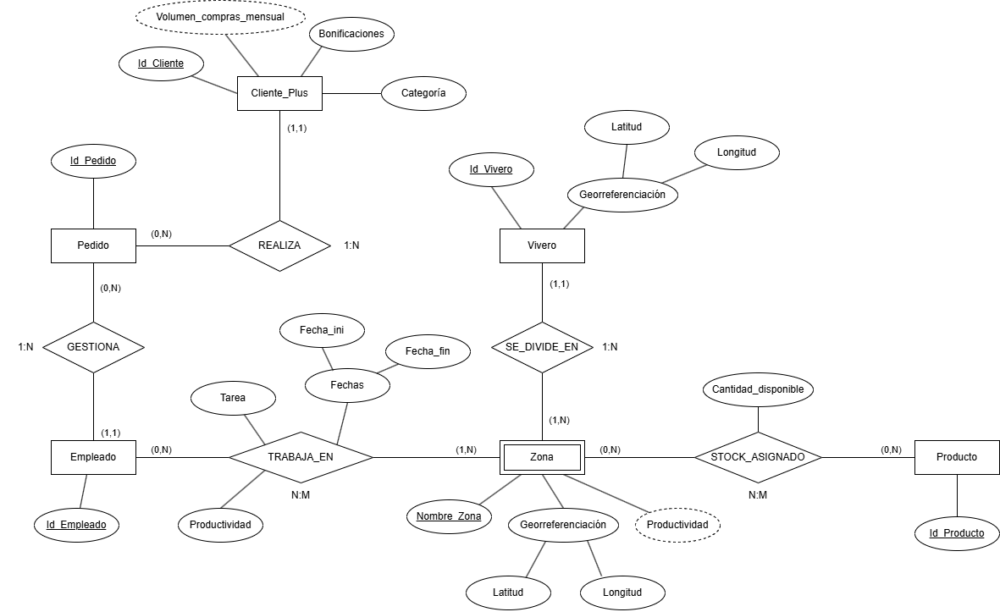

# Práctica 2: Modelo Entidad-Relación - Tajinaste S.A.

## Archivos incluidos en el repositorio
* `practica2_adbd.drawio`: Archivo fuente editable con el diagrama Entidad-Relación.
* `practica2_adbd.drawio.png`: Imagen exportada del modelo conceptual.

---

## 1. Descripción de las Entidades

* **Vivero (Entidad Fuerte):** Representa cada uno de los centros físicos que conforman la red de ventas de plantas, jardinería y decoración de la empresa[cite: 2, 3].
* **Zona (Entidad Débil):** Representa las distintas áreas o divisiones operativas ubicadas dentro de un vivero específico (por ejemplo, almacén, zona exterior, invernadero)[cite: 2, 3]. Es una entidad débil por identificación, ya que el nombre de una zona no es único por sí solo, sino que depende del vivero al que pertenece.
* **Producto (Entidad Fuerte):** Representa los artículos comercializados por Tajinaste S.A. (plantas, productos de jardinería y decoración) cuyo stock se desea controlar en las diferentes zonas[cite: 2, 3].
* **Empleado (Entidad Fuerte):** Representa a los trabajadores de la empresa, los cuales son destinados a distintas zonas según la época del año y se encargan de gestionar los pedidos de los clientes fidelizados[cite: 2, 3].
* **Cliente_Plus (Entidad Fuerte):** Representa a los clientes adheridos al programa de fidelización *Tajinaste Plus*, a quienes se les realiza un seguimiento de sus compras mensuales para asignarles bonificaciones y dirigir campañas comerciales[cite: 2, 3].
* **Pedido (Entidad Fuerte):** Representa las órdenes de compra efectuadas por los clientes del programa *Tajinaste Plus* desde su ingreso en el mismo, las cuales son gestionadas por un único empleado responsable[cite: 2, 3].

---

## 2. Dominio de los Atributos (Entidades y Relaciones)

### Atributos de Entidades

#### **Vivero**
* **`Id_Vivero`** *(Clave Primaria)*: Código alfanumérico único que identifica a cada vivero.
  * *Dominio:* Cadena de caracteres de longitud fija (ej. `VIV-001`, `VIV-002`).
* **`Georreferenciación`** *(Atributo Compuesto)*: Ubicación geográfica exacta del vivero[cite: 2, 3]. Se descompone en:
  * **`Latitud`**: Coordenada geográfica norte/sur en grados decimales[cite: 2, 3]. *Dominio:* Número real entre `-90.0` y `90.0` (ej. `28.487401`).
  * **`Longitud`**: Coordenada geográfica este/oeste en grados decimales[cite: 2, 3]. *Dominio:* Número real entre `-180.0` y `180.0` (ej. `-16.315906`).

#### **Zona**
* **`Nombre_Zona`** *(Clave Parcial / Discriminador)*: Nombre descriptivo del área dentro de un vivero[cite: 2, 3].
  * *Dominio:* Cadena de texto (ej. `"Zona Exterior"`, `"Almacén Principal"`, `"Invernadero A"`).
* **`Georreferenciación`** *(Atributo Compuesto)*: Coordenadas específicas donde se sitúa la zona dentro del vivero[cite: 2, 3]. Se compone de:
  * **`Latitud`**: Grados decimales[cite: 2, 3] (ej. `28.487510`).
  * **`Longitud`**: Grados decimales[cite: 2, 3] (ej. `-16.315800`).
* **`Productividad`** *(Atributo Derivado)*: Índice global de rendimiento de la zona a lo largo del tiempo, calculado a partir de la productividad obtenida por los empleados asignados a dicha zona[cite: 2, 3].
  * *Dominio:* Número real o porcentaje de `0.0` a `100.0` (ej. `87.5%`).

#### **Producto**[cite: 3]
* **`Id_Producto`** *(Clave Primaria)*: Identificador único de cada artículo del catálogo[cite: 3].
  * *Dominio:* Cadena alfanumérica (ej. `PROD-1045`, `PLA-0089`).

#### **Empleado**[cite: 3]
* **`Id_Empleado`** *(Clave Primaria)*: Código interno o documento de identidad que identifica de manera única al trabajador[cite: 3].
  * *Dominio:* Cadena alfanumérica de 9 caracteres / DNI (ej. `45892312X` o `EMP-042`).

#### **Cliente_Plus**[cite: 3]
* **`Id_Cliente`** *(Clave Primaria)*: Identificador único del socio en el programa *Tajinaste Plus*[cite: 2, 3].
  * *Dominio:* Cadena alfanumérica (ej. `CPLUS-00154`, `43123456Z`).
* **`Volumen_compras_mensual`** *(Atributo Derivado)*: Suma del importe o cantidad de pedidos realizados por el cliente en el mes en curso[cite: 2, 3].
  * *Dominio:* Número decimal positivo expresado en euros (ej. `245.50 €`, `1200.00 €`).
* **`Bonificaciones`**: Beneficios o descuentos asignados al cliente en función de su volumen de compras mensual[cite: 2, 3].
  * *Dominio:* Cadena de texto o porcentaje de descuento (ej. `"15% descuento próximo pedido"`, `"Bono 20€"`).
* **`Categoría`**: Nivel de fidelización o clasificación asociada dentro del catálogo/programa[cite: 3].
  * *Dominio:* Enumerado / Cadena de texto (ej. `"Estándar"`, `"Oro"`, `"Platino"` o preferencia `"Jardinería"`, `"Decoración"`).

#### **Pedido**[cite: 3]
* **`Id_Pedido`** *(Clave Primaria)*: Código único de registro de cada compra realizada[cite: 3].
  * *Dominio:* Cadena alfanumérica secuencial (ej. `PED-2026-00891`).

---

### Atributos de Relaciones

#### **Relación `STOCK_ASIGNADO`**[cite: 3]
* **`Cantidad_disponible`**: Número de unidades físicas de un producto concreto disponibles en una zona determinada[cite: 2, 3].
  * *Dominio:* Número entero mayor o igual a cero `>= 0` (ej. `0`, `45`, `250` unidades).

#### **Relación `TRABAJA_EN`**[cite: 3]
* **`Tarea`**: Puesto o labor específica que desempeña el empleado durante su asignación a esa zona[cite: 2, 3].
  * *Dominio:* Cadena de caracteres (ej. `"Mantenimiento de riego"`, `"Control de inventario"`, `"Atención al público"`).
* **`Productividad`**: Evaluación del rendimiento del empleado en dicho puesto y zona durante el periodo asignado[cite: 2, 3].
  * *Dominio:* Valor numérico o escala del `0` al `100` (ej. `92.0` puntos).
* **`Fechas`** *(Atributo Compuesto)*: Rango temporal en el que el empleado estuvo destinado en la zona, permitiendo conservar el seguimiento histórico[cite: 2, 3]. Se divide en:
  * **`Fecha_ini`**: Fecha de inicio del destino[cite: 3]. *Dominio:* Fecha en formato `AAAA-MM-DD` (ej. `2026-03-01`).
  * **`Fecha_fin`**: Fecha de finalización del destino[cite: 3]. *Dominio:* Fecha en formato `AAAA-MM-DD` o `NULL` si sigue activo (ej. `2026-06-30`).

---

## 3. Descripción de las Relaciones y Cardinalidades

* **`SE_DIVIDE_EN` (Vivero — Zona)**[cite: 3]
  * **Descripción:** Relación jerárquica que vincula a cada vivero con las zonas que lo componen[cite: 2, 3].
  * **Cardinalidad Global:** **1:N** (Uno a Muchos)[cite: 3].
  * **Detalle de participación:** Un vivero se divide en un mínimo de 1 y un máximo de N zonas `(1,N)`[cite: 3]. Cada zona pertenece única y exclusivamente a un vivero `(1,1)`[cite: 3].

* **`STOCK_ASIGNADO` (Zona — Producto)**[cite: 3]
  * **Descripción:** Registra qué productos están ubicados en qué zonas de los viveros y en qué cantidad[cite: 2, 3].
  * **Cardinalidad Global:** **N:M** (Muchos a Muchos)[cite: 3].
  * **Detalle de participación:** En una zona pueden asignarse desde ningún producto hasta muchos productos distintos `(0,N)`[cite: 3]. A su vez, un mismo producto puede no tener stock asignado temporalmente o estar repartido en múltiples zonas `(0,N)`[cite: 3].

* **`TRABAJA_EN` (Empleado — Zona)**[cite: 3]
  * **Descripción:**Recoge el histórico de puestos y destinos de los empleados en las diferentes zonas de los viveros a lo largo de las distintas épocas del año[cite: 2, 3].
  * **Cardinalidad Global:** **N:M** (Muchos a Muchos)[cite: 3].
  * **Detalle de participación:** Un empleado pasa por una o varias zonas a lo largo de su historial laboral `(1,N)`[cite: 3], y en una zona pueden desempeñar tareas cero o muchos empleados a lo largo del tiempo `(0,N)`[cite: 3].

* **`REALIZA` (Cliente_Plus — Pedido)**[cite: 3]
  * **Descripción:** Asocia a los clientes del programa de fidelización *Tajinaste Plus* con los pedidos que han efectuado desde su alta en el programa[cite: 2, 3].
  * **Cardinalidad Global:** **1:N** (Uno a Muchos)[cite: 3].
  * **Detalle de participación:** Un cliente *Tajinaste Plus* puede haber realizado cero o muchos pedidos `(0,N)`[cite: 3], mientras que cada pedido registrado corresponde a un único cliente `(1,1)`[cite: 3].

* **`GESTIONA` (Empleado — Pedido)**[cite: 3]
  * **Descripción:** Permite controlar qué empleado es responsable de cada pedido de cara a medir su capacidad para lograr objetivos de venta[cite: 2, 3].
  * **Cardinalidad Global:** **1:N** (Uno a Muchos)[cite: 3].
  * **Detalle de participación:** Un empleado puede gestionar desde ninguno hasta múltiples pedidos `(0,N)`[cite: 3], pero cada pedido tiene única y exclusivamente un empleado responsable `(1,1)`[cite: 2, 3].

---

## 4. Restricciones Semánticas y de Integridad

Para garantizar que el modelo cumpla fielmente todas las reglas de negocio del escenario planteado que no pueden expresarse únicamente mediante cardinalidades gráficas, se establecen las siguientes restricciones semánticas:

1. **Exclusividad temporal de destino en empleados:** Un empleado nunca puede tener dos destinos simultáneos en una misma época del año. Por tanto, para un mismo `Id_Empleado` en la relación `TRABAJA_EN`, los intervalos formados por `[Fecha_ini, Fecha_fin]` no pueden solaparse en el tiempo[cite: 2, 3].
2. **Coherencia temporal en fechas de destino:** En cualquier instancia de la relación `TRABAJA_EN`, el atributo `Fecha_fin` (cuando no sea nulo) debe ser estrictamente posterior o igual a `Fecha_ini` (`Fecha_fin >= Fecha_ini`)[cite: 3].
3. **Clave primaria compuesta de la entidad débil `Zona`:** Al ser una entidad débil por identificación, la clave primaria completa de `Zona` se forma concatenando la clave primaria del vivero (`Id_Vivero`) y su discriminador (`Nombre_Zona`)[cite: 3].
4. **Identificación del histórico en `TRABAJA_EN`:** Para que un mismo empleado pueda volver a ser destinado a la misma zona en diferentes épocas del año sin duplicar la clave en la relación `N:M`, el atributo `Fecha_ini` forma parte de la clave primaria de la relación junto con `Id_Empleado`, `Id_Vivero` y `Nombre_Zona`[cite: 2, 3].
5. **Control de pedidos tras el ingreso:** Todos los pedidos registrados en la relación `REALIZA` deben tener una fecha de realización igual o posterior a la fecha de ingreso del `Cliente_Plus` en el programa de fidelización[cite: 2, 3].
